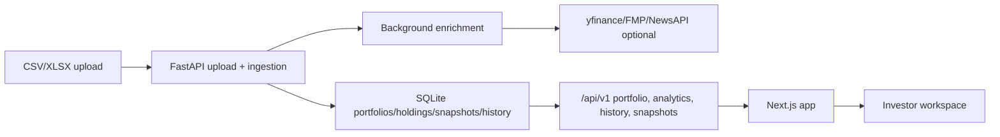

# P-Insight

P-Insight is a portfolio intelligence platform for retail equity investors. It turns a portfolio upload into a structured analytics workspace covering holdings, P&L, allocation, concentration risk, fundamentals, peer comparison, market context, news, snapshots, and advisor-style commentary.

The current product is optimized around Indian equity portfolios and local/private use.

## What It Does

The core user journey is:

1. Upload a broker/manual CSV or Excel portfolio file.
2. Review detected columns and confirm mappings.
3. Import holdings into an active portfolio.
4. Let the backend enrich tickers with price, sector, name, fundamentals, peers, and history data.
5. Use the app to inspect portfolio value, P&L, sector exposure, concentration, market risk, fundamentals, peer valuation, changes over time, news, and watchlist ideas.

## Main Features

- Upload and ingestion: CSV/XLSX parsing, column detection, mapping, row validation, warnings, rejected rows, background enrichment.
- Dashboard: portfolio KPIs, sector breakdown, top holdings, risk snapshot, insights, recent changes.
- Holdings: position-level table with value, P&L, weights, sectors, and data-source indicators.
- Fundamentals: per-holding ratios, weighted portfolio fundamentals, coverage metadata, valuation/quality/growth/leverage metrics.
- Risk: concentration risk plus historical quant analytics such as volatility, Sharpe, Sortino, drawdown, beta, VaR, correlation, benchmark comparison.
- Changes: snapshots, deltas, daily synthetic portfolio history, since-purchase P&L, benchmark history.
- Market: Indian index and sector context, gainers/losers, headlines placeholder.
- Peers: compare selected holdings against peers with server-side rankings and sparse/incomplete metadata.
- News: portfolio-relevant news and event feed where provider data is configured.
- Watchlist: track research names with tags, target prices, notes, and live price lookup.
- Advisor: AI-backed or rule-based portfolio question answering.
- Portfolio management: multiple portfolios, active portfolio switching, rename, delete, refresh/re-import, snapshots.

## Current Maturity

Core visible pages:

- `/market`
- `/dashboard`
- `/holdings`
- `/fundamentals`
- `/risk`
- `/changes`
- `/peers`
- `/news`
- `/watchlist`
- `/portfolios`
- `/upload`
- `/advisor`

Hidden, beta, scaffold, or deprecated pages:

- `/brokers`
- `/optimize`
- `/simulate`
- `/screener`
- `/sectors`
- `/frontier`
- `/ai-chat`
- `/debug` in development

## Architecture

P-Insight is a frontend/backend monorepo.

```text
frontend/  Next.js, React, TypeScript, Tailwind, Zustand
backend/   FastAPI, SQLAlchemy, Pydantic, SQLite, pandas/numpy, yfinance
docs/      architecture, design, feature specs, audit, backlog
```

High-level flow:



## Backend

Backend entry point:

```bash
cd backend
poetry install --no-root
poetry run uvicorn app.main:app --reload --port 8000
```

Important backend folders:

- `app/api/v1/endpoints`: route modules.
- `app/core`: configuration and dependencies.
- `app/data_providers`: uploaded/live/broker/mock provider implementations.
- `app/ingestion`: file parsing, normalization, enrichment.
- `app/models`: SQLAlchemy models.
- `app/schemas`: Pydantic contracts.
- `app/services`: business workflows.
- `app/analytics`: returns, risk, benchmark, quant calculations.
- `app/optimization`: efficient frontier and rebalance logic.

## Backend Module Boundaries

The backend is a modular monolith. The current isolation work defines these service boundaries:

- Portfolio reads: `PortfolioReadService` owns active/default portfolio lookup, holdings reads, summary, sector allocation, and concentration risk calculations.
- Upload workflow: `PostUploadWorkflow` owns post-confirm upload side effects after the base portfolio is persisted.
- History contract: canonical history APIs expose only `building`, `complete`, `failed`, and `not_started`.
- Cache/status wrappers: `TimedMemoryCache` and `HistoryBuildStatusStore` isolate process-local cache/status state.
- Snapshot reads: `SnapshotReadService` owns recent snapshot briefs and recent-change summaries for context consumers.
- Advisor orchestration: `AIAdvisorService` consumes portfolio/context/snapshot read boundaries instead of owning portfolio aggregation logic.

Detailed module contracts live in `docs/backend-module-contracts.md`.

Health endpoints:

- `GET /health`
- `GET /readiness`
- `GET /docs` only when `DOCS_ENABLED=true`

## Frontend

Frontend startup:

```bash
cd frontend
pnpm install
pnpm dev
```

Default backend URL:

```text
NEXT_PUBLIC_API_URL=http://localhost:8000
```

Important frontend folders:

- `src/app`: routes/pages.
- `src/components`: reusable feature and layout components.
- `src/context/PortfolioContext.tsx`: shared portfolio data provider.
- `src/hooks`: feature data hooks.
- `src/services/api.ts`: typed backend API client.
- `src/store`: Zustand stores.
- `src/types/index.ts`: shared frontend types.

## Data Model

Main persisted entities:

- Portfolio: saved portfolio metadata and active state.
- Holding: ticker, quantity, cost, price, sector, enrichment metadata.
- Watchlist: research tickers and notes.
- Snapshot: point-in-time portfolio capture.
- Snapshot holding: holding record inside a snapshot.
- Broker connection: scaffolded broker connection state.
- Portfolio history: synthetic daily value history.
- Benchmark history: index close price history.

## Data Modes

Supported runtime modes:

- `uploaded`: uploaded portfolio data, current default.
- `live`: live provider mode using active DB holdings and yfinance/FMP.
- `broker`: future broker sync mode.

`mock` provider code remains in the repository, but `mock` mode is intentionally disabled by runtime dependencies and the frontend data-mode store.

## Environment Variables

Backend commonly used variables:

```text
APP_ENV=development
DEBUG=false
DOCS_ENABLED=false
FRONTEND_URL=http://localhost:3000
DATABASE_URL=sqlite:///./p_insight.db
DEFAULT_DATA_MODE=uploaded
LIVE_API_ENABLED=true
BROKER_SYNC_ENABLED=false
AI_CHAT_ENABLED=false
FINANCIAL_MODELING_PREP_API_KEY=
NEWS_API_KEY=
OPENAI_API_KEY=
ANTHROPIC_API_KEY=
```

Frontend:

```text
NEXT_PUBLIC_API_URL=http://localhost:8000
```

## Verification Status From Current Audit

Frontend:

```bash
cd frontend
pnpm type-check
```

Current result: passes.

Backend:

```bash
cd backend
poetry run python -m compileall app
```

Current result: passes.

```bash
cd backend
poetry run pytest
```

Current result: passes.

## Known Limitations

- Frontend type-check is not clean.
- Backend test environment is not currently verified.
- SQLite/local-first persistence is the current default.
- No Alembic migration tree was observed.
- Several caches and build statuses are process-local, now behind lightweight service wrappers.
- Broker sync is scaffolded, not production-ready.
- Corporate event coverage is limited/scaffolded.
- Some mock-mode code remains even though mock mode is disabled.

## Best Starting Points For New Contributors

Read these first:

- `PROJECT_README.md`
- `docs/current-state-audit-2026-04-24.md`
- `docs/architecture-design-current.md`
- `docs/technical-design-current.md`
- `docs/feature-specification-current.md`
- `docs/backend-module-contracts.md`
- `docs/02-status-and-backlog.md`

Then inspect these files:

- `backend/app/main.py`
- `backend/app/api/v1/router.py`
- `backend/app/core/config.py`
- `backend/app/core/dependencies.py`
- `backend/app/services/portfolio_service.py`
- `backend/app/services/upload_v2_service.py`
- `backend/app/services/post_upload_workflow.py`
- `backend/app/services/cache_service.py`
- `backend/app/services/snapshot_service.py`
- `backend/app/services/context_builder.py`
- `frontend/src/context/PortfolioContext.tsx`
- `frontend/src/services/api.ts`
- `frontend/src/components/layout/Sidebar.tsx`

## Author

Dhruv Tantia

Statistics + Financial Risk Management, University of Waterloo
