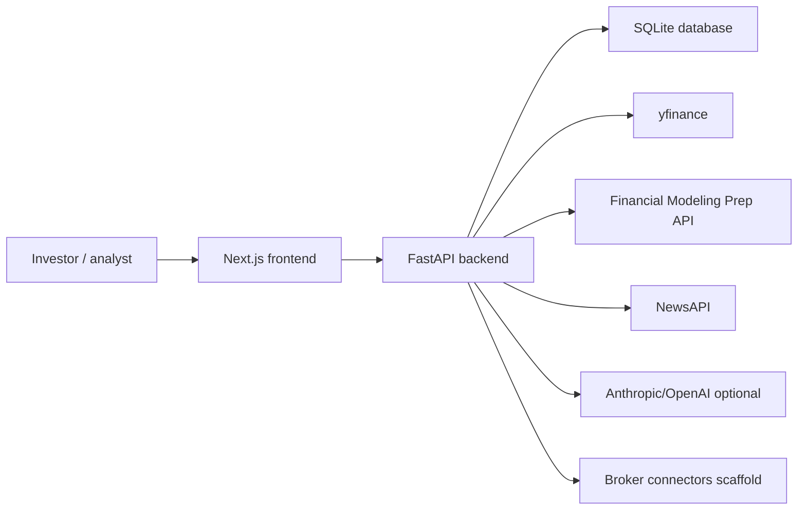

# P-Insight Architecture Design

## Purpose

P-Insight is a portfolio intelligence workspace for retail equity investors, with a current product emphasis on Indian equities. The design goal is to convert a user-owned portfolio file into a coherent set of insights: holdings, P&L, sector exposure, concentration risk, fundamentals, peers, news, historical changes, and advisory commentary.

The system is intentionally modular: a frontend product shell consumes typed API contracts from a FastAPI backend; the backend hides provider-specific details behind a data provider interface and keeps financial calculations close to server-side services.

## Architectural Principles

- Backend owns canonical financial computation where possible.
- Frontend owns presentation, navigation, interaction state, and user workflow.
- Provider-specific behavior is isolated behind `BaseDataProvider`.
- Core portfolio context should be fetched once and shared across pages.
- External data failures should surface as degraded or unavailable states, not silent mock substitutions.
- Upload should be fast; slow enrichment should run in the background and be visible through status APIs.
- Experimental routes can remain accessible by direct URL, but should not expand the visible product surface until they are reliable.

## System Context



## Runtime Components

### Frontend

The frontend is a client-rendered Next.js application with App Router pages under `frontend/src/app`. The app uses:

- `AppShell` for persistent layout.
- `Sidebar` for route grouping.
- `Topbar` and `IndexTicker` for global status and market context.
- `PortfolioProvider` for shared portfolio bundle state.
- Zustand stores for data mode, active portfolio metadata, filters, and simulation state.
- Feature hooks for quant, optimization, history, snapshots, peers, news, watchlist, broker, advisor, and live data.

### Backend

The backend is a FastAPI app under `backend/app`.

- `app/main.py` creates the app, configures CORS, registers routers, initializes DB tables, and exposes health/readiness.
- `app/api/v1/router.py` aggregates all versioned route modules under `/api/v1`.
- `app/core/config.py` loads environment settings.
- `app/core/dependencies.py` selects the active data provider based on query `mode`.
- `app/models` defines SQLAlchemy persistence.
- `app/schemas` defines Pydantic API contracts.
- `app/services` owns business workflows.
- `app/analytics` and `app/optimization` own computation-heavy logic.
- `app/ingestion` owns upload parsing, normalization, and enrichment.

<<<<<<< HEAD
=======
Current backend module boundaries:

- Portfolio aggregation is read through `PortfolioReadService`.
- Upload side effects are coordinated by `PostUploadWorkflow`.
- History APIs expose canonical states through endpoint-level resolver helpers.
- Quant cache and history build status are wrapped by `cache_service.py`.
- Snapshot history for context consumers is read through `SnapshotReadService`.
- Advisor service orchestrates provider calls and consumes read boundaries instead of owning portfolio/snapshot calculations.

>>>>>>> 62ebaca6615a2a31797d270875862ac7ba49ce7a
## Primary Data Flow

```mermaid
sequenceDiagram
  participant U as User
  participant FE as Upload Page
  participant API as Upload API
  participant DB as SQLite
  participant BG as Background Enrichment
  participant Dash as Dashboard

  U->>FE: Select CSV/XLSX
  FE->>API: POST /api/v1/upload/parse
  API-->>FE: Preview, detected columns, mapping candidates
  U->>FE: Confirm mapping
  FE->>API: POST /api/v1/upload/v2/confirm
  API->>DB: Save active portfolio + pending holdings
<<<<<<< HEAD
=======
  API->>API: Run PostUploadWorkflow
>>>>>>> 62ebaca6615a2a31797d270875862ac7ba49ce7a
  API-->>FE: Accepted/rejected/warning rows + portfolio_id
  API->>BG: Enrich sectors/prices/fundamentals, prewarm quant, build history
  FE->>Dash: Navigate to dashboard
  Dash->>API: GET /api/v1/portfolio/full
  API-->>Dash: Holdings, summary, sectors, risk snapshot, meta
```

## Portfolio Context Design

The current frontend uses `PortfolioProvider` as the shared in-browser source for core portfolio data.

Inputs:

- `useDataModeStore().mode`
- `GET /api/v1/portfolio/full`
- non-blocking `GET /api/v1/analytics/commentary`

Outputs to pages:

- holdings
- summary
- sectors
- risk snapshot
- fundamentals availability summary
- provenance meta
- commentary insights
- loading/error/stale state
- shared refetch

This design reduces redundant calls and makes the backend's `portfolio/full` response the first-class aggregate contract.

## Data Provider Design

`BaseDataProvider` defines the provider contract:

- identity: `mode_name`, `is_available`
- holdings: `get_holdings`
- price history: `get_price_history`
- fundamentals: `get_fundamentals`
- news/events: `get_news`, optional `get_events`
- peers: `get_peers`
- benchmark history: optional `get_benchmark_history`

Current provider implementations:

- `FileDataProvider`: uploaded portfolio data, in-memory plus DB-backed active portfolio behavior.
- `LiveAPIProvider`: yfinance/FMP/NewsAPI backed live data using active portfolio holdings.
- `BrokerSyncProvider`: future broker mode placeholder.
- `MockDataProvider`: retained code but mock mode is disabled in request dependency selection.

## Persistence Design

SQLite is the default persistence layer. The model is single-user/local-first today, with PostgreSQL documented for production.

Main aggregates:

- Portfolio: active portfolio list and source metadata.
- Holding: positions plus enrichment metadata.
- Snapshot: immutable point-in-time portfolio captures.
- History: synthetic daily portfolio and benchmark series.
- Watchlist: research tickers outside the portfolio.
- Broker connection: connection lifecycle scaffolding.

## Module Boundaries

Core modules:

- Upload and ingestion.
- Portfolio aggregation.
- Holdings and dashboard.
- Fundamentals.
- Risk and quant analytics.
- History and changes.
- Market context.

Secondary modules:

- Peers.
- News and events.
- Watchlist.
- Advisor.
- Portfolio management.

Experimental/scaffold modules:

- Broker sync.
- Optimization.
- Simulation.
- Screener.
- Legacy frontier.
- Standalone AI chat.

## Failure Handling Philosophy

The implemented system generally tries to:

- keep stale portfolio data visible after failed refreshes;
- label incomplete fundamentals, peers, and quant coverage;
- avoid silent mock fallback in live/uploaded mode;
- expose health and readiness endpoints;
- isolate slow enrichment/history/quant work from upload confirmation.

<<<<<<< HEAD
Remaining design concern: several caches and status maps are process-local. A production deployment should introduce persistent job state and durable cache/storage for expensive data.
=======
Remaining design concern: several caches and status maps are still process-local, although the quant cache and history build status now sit behind wrappers. A production deployment should introduce persistent job state and durable cache/storage for expensive data.
>>>>>>> 62ebaca6615a2a31797d270875862ac7ba49ce7a

## Non-Goals In Current Architecture

- Multi-user authentication and authorization.
- Full broker OAuth/session lifecycle.
- Trading execution.
- Tax reporting.
- Paid-grade corporate action calendar.
- Production migration system.
- Formal background job queue.
