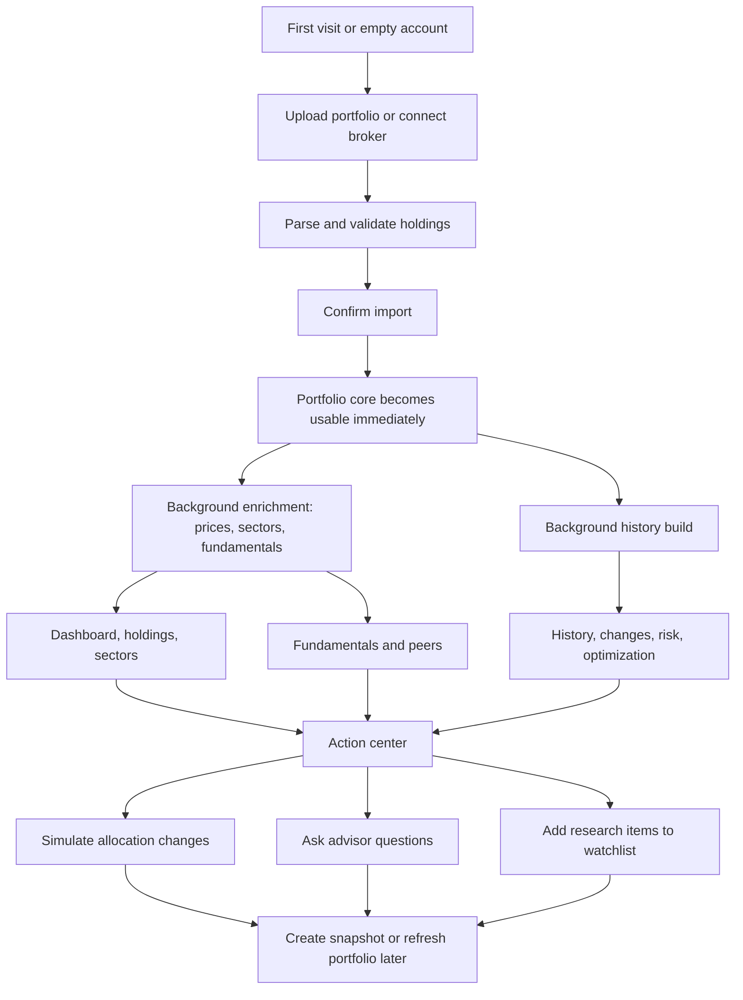

# P-Insight Product Functional Specification

Date: 2026-05-01

This document describes the ideal functional version of P-Insight as a portfolio intelligence product for general retail investors. It is intentionally implementation-neutral: a team should be able to rebuild the same product experience using different tools if they preserve the workflows, feature contracts, data objects, and failure behavior described here.

The core goal is to make P-Insight the investor's primary portfolio insight workspace: one place to upload or sync holdings, understand allocation and risk, evaluate fundamentals and peers, track change over time, simulate rebalancing, ask natural-language questions, and convert analysis into practical next actions.

## Product Promise

P-Insight should answer four recurring retail-investor questions:

1. What do I own, and how is it performing?
2. Where are the major risks, concentrations, and weak points?
3. Which holdings deserve more research, trimming, adding, or replacement?
4. What would happen if I changed my allocation?

The product should avoid pretending uncertain data is certain. Every page must expose data freshness, coverage, unavailable dependencies, and whether the result is complete, partial, stale, or unavailable.

P-Insight should not be a trading execution product. It should produce insight, education, scenario analysis, and decision support. Recommendations must be explainable, risk-aware, and clearly tied to data shown elsewhere in the app.

## Core Product Workflow



The investor's ideal loop:

1. Import holdings.
2. Review dashboard summary and data quality.
3. Inspect holdings and sector concentration.
4. Check fundamental valuation and quality.
5. Compare important holdings against peers.
6. Review risk, drawdown, volatility, beta, correlation, and benchmark-relative behavior.
7. Use optimization and simulation to test changes before acting.
8. Ask the advisor to summarize issues, explain tradeoffs, or prepare a review checklist.
9. Save snapshots and track what changed over time.
10. Maintain a watchlist for future research and possible replacements.

## System-Wide States

Every feature should be able to render these states without breaking the rest of the application:

- `empty`: no active portfolio or no holdings.
- `importing`: file or broker data is being parsed and confirmed.
- `enriching`: base holdings are usable, but background enrichment is still running.
- `ready`: all required data for that feature is available.
- `partial`: feature can render but some holdings, metrics, or dependencies are missing.
- `stale`: last successful data is shown while refresh failed or is delayed.
- `disabled`: feature has been intentionally disconnected.
- `unavailable`: required dependency or provider is unavailable.
- `error`: unexpected failure; feature should isolate the failure and expose retry/recovery.

The app shell, portfolio core, and navigation must survive optional feature failures.

## Canonical Data Objects

### Feature Health

Purpose: tell the app which modules are attached, degraded, disabled, or unavailable.

Contract:

```txt
FeatureHealth {
  feature_id: stable feature identifier
  label: human-readable name
  status: enabled | disabled | degraded | unavailable
  route_prefix: backend/API route ownership
  reason: optional explanation
  dependencies: list of dependency health objects
  side_effects: known writes/jobs triggered by the feature
  failure_behavior: how the feature should fail without harming others
  frontend_owner_hook: frontend feature owner
  disable_behavior: expected UI behavior when disconnected
}
```

Interaction rules:

- Navigation should hide or mark disabled features.
- Optional panels should show degraded/unavailable states instead of crashing.
- Routes should block disabled/unavailable features before expensive dependencies run.

### Portfolio

Purpose: represent one user-owned investment set.

Contract:

```txt
Portfolio {
  id
  name
  source: uploaded | broker | manual | demo
  is_active
  description
  upload_filename
  num_holdings
  last_synced_at
  source_metadata
  created_at
  updated_at
  is_refreshable
}
```

Interaction rules:

- One portfolio is active at a time.
- All analytics default to the active portfolio unless a specific portfolio is selected.
- Uploaded and broker portfolios are refreshable.
- Manual portfolios may exist but should not block uploaded/broker workflows.

### Holding

Purpose: represent one position in a portfolio.

Required input fields:

```txt
ticker
quantity
average_cost
```

Optional input fields:

```txt
name
current_price
sector
industry
purchase_date
asset_class
currency
notes
```

Enrichment fields:

```txt
normalized_ticker
sector_status: from_file | provider | static_map | unknown
name_status: from_file | provider | static_map | ticker_fallback
fundamentals_status: pending | fetched | unavailable
peers_status: pending | fetched | unavailable
enrichment_status: pending | enriched | partial | failed
failure_reason
last_enriched_at
```

Computed output fields:

```txt
market_value = quantity * current_price
total_cost = quantity * average_cost
pnl = market_value - total_cost
pnl_pct = pnl / total_cost
weight = market_value / portfolio_total_value
```

Interaction rules:

- Portfolio core owns holding totals and weights.
- Other features should consume computed holding values instead of recalculating independently.
- Missing prices must create partial/degraded states, not fake values.

### Portfolio Intelligence Bundle

Purpose: one canonical response for dashboard, holdings, sectors, and core context.

Contract:

```txt
PortfolioBundle {
  holdings: enriched holdings with computed market value, P&L, and weight
  summary: total value, cost, P&L, P&L %, holding count, top sector
  sectors: sector allocation rows
  risk_snapshot: concentration and diversification snapshot
  fundamentals_summary: basic fundamentals coverage metadata
  meta: portfolio identity, freshness, enrichment state, lifecycle state
}
```

Interaction rules:

- Dashboard, holdings, sectors, advisor context, and action center should depend on this bundle.
- Optional analytics may enrich the experience, but the portfolio bundle must work first.

### Snapshot

Purpose: immutable record of portfolio state at a point in time.

Contract:

```txt
Snapshot {
  id
  portfolio_id
  label
  captured_at
  total_value
  total_cost
  total_pnl
  total_pnl_pct
  num_holdings
  top_sector
  holdings
  sector_weights
  risk_metrics
  top_holdings
}
```

Interaction rules:

- Snapshots are used for comparisons, advisor context, and long-term portfolio change analysis.
- Refresh/import workflows should create snapshots before and after meaningful changes when possible.

### Data Quality Metadata

Every feature that returns analytics should include:

```txt
as_of
source
coverage_pct
incomplete
unavailable_tickers
excluded_reason
cached or stale marker
provider/dependency status
```

This metadata is required because a retail investor must know whether the result is reliable enough to act on.

## Feature Specifications

### 1. App Shell And Navigation

Purpose: provide the persistent workspace around all features.

User outcomes:

- Move between portfolio, analytics, market, advisor, and research workflows.
- See current data mode/source and active portfolio context.
- See major disabled/degraded states without discovering them through page crashes.

Required inputs:

- Feature registry.
- Active portfolio metadata.
- Market index summary for ticker strip.
- User-selected data/source mode.

Outputs:

- Sidebar navigation grouped by core and secondary workflows.
- Topbar with active portfolio/source context.
- Market index ticker with stale/unavailable handling.
- Global empty states and setup calls to action.

Interactions:

- Consumes feature health to hide or mark disabled features.
- Consumes portfolio core for active context.
- Consumes market data for index strip.

Failure behavior:

- If feature registry fails, keep core navigation visible and mark feature health unknown.
- If market index data fails, show compact unavailable/stale state without blocking navigation.

### 2. Feature Registry

Purpose: central plug-in contract for feature isolation.

User outcomes:

- Optional features can be disconnected without breaking the product.
- Debugging can isolate a feature, fix it, and reattach it.

Required inputs:

- Feature flags.
- Dependency health: market data provider, news provider, AI provider, broker connector state.

Outputs:

- Feature health list.
- Disabled/degraded/unavailable metadata.
- Typed disabled response for blocked feature routes.

Interactions:

- Navigation consumes feature health.
- Feature routes use feature dependency checks.
- Diagnostics displays full feature status.

Failure behavior:

- Missing/unregistered feature should be treated as unavailable.
- Disabled features should not run their internal dependencies.

### 3. Portfolio Core

Purpose: stable backbone of the app. Everything meaningful starts with portfolio data.

User outcomes:

- See all holdings, values, P&L, weights, allocation, and core concentration risk.
- Understand whether the portfolio is empty, enriching, degraded, or ready.

Required inputs:

- Active portfolio id or selected portfolio id.
- Holdings from uploaded, broker, manual, or demo source.
- Latest available price fields.
- Enrichment status fields.

Outputs:

```txt
PortfolioBundle
Holdings[]
PortfolioSummary
SectorAllocation[]
RiskSnapshot
PortfolioBundleMeta
```

Feature contract:

- Portfolio core must work even if fundamentals, quant, market, news, advisor, broker sync, and history are disabled.
- Portfolio core owns portfolio aggregation math: total value, cost, P&L, P&L %, weights, sector allocation, and concentration snapshot.
- Consumers should not duplicate portfolio totals.

Interactions:

- Upload and broker sync create/update portfolios and holdings.
- Dashboard, holdings, sectors, advisor, fundamentals, risk, optimization, simulation, and history all read portfolio core.
- Snapshots preserve portfolio core state over time.

Failure behavior:

- No portfolio: show upload/connect call to action.
- Missing prices: return partial portfolio with metadata.
- Enrichment pending: return usable portfolio with `enriching` state.

### 4. Upload And Import

Purpose: let a retail investor import a broker CSV/Excel file without needing perfect column names.

User outcomes:

- Drop a file.
- Review detected columns and preview rows.
- Confirm import.
- Use the portfolio immediately while enrichment continues.

Required inputs:

- CSV or spreadsheet file.
- Column mapping for ticker, quantity, average cost, and optional fields.

Parse output:

```txt
ParseResult {
  column_names
  detected_mapping
  ambiguous_fields
  high_confidence
  preview_rows
  row_count
  missing_optional
  required_fields
  optional_fields
}
```

Confirm output:

```txt
ImportResult {
  portfolio_id
  filename
  imported_at
  total_rows
  rows_valid
  rows_valid_with_warning
  rows_invalid
  rejected_rows
  warning_rows
  enrichment_started
  enrichment_complete
  portfolio_usable
  next_action
  message
}
```

Status output:

```txt
UploadStatus {
  portfolio_id
  total_holdings
  enriched
  partial
  pending
  failed
  enrichment_complete
  overall: in_progress | done | failed
  holdings: HoldingEnrichmentStatus[]
}
```

Interactions:

- Creates a portfolio and holdings.
- Schedules enrichment for sector, name, prices, fundamentals, and peers status.
- Schedules history build.
- May trigger analytics warmup but must not depend on it for correctness.
- Portfolio core should be usable before enrichment finishes.

Failure behavior:

- Parse failure must not write data.
- Confirm failure must not corrupt existing portfolios.
- Enrichment failure must not delete or block the imported portfolio.
- History failure must not block dashboard/holdings.
- Quant warmup failure must not block upload success.

### 5. Portfolio Management And Source Refresh

Purpose: manage multiple portfolios and keep uploaded/broker portfolios up to date.

User outcomes:

- List portfolios.
- Activate a portfolio.
- Rename/delete portfolios.
- Create manual portfolios.
- Re-import a source file into an existing portfolio.
- View source metadata and sync freshness.
- Create and compare snapshots.

Required inputs:

- Portfolio id.
- Optional new name/description.
- Optional refresh file and column mapping.

Outputs:

```txt
PortfolioList {
  portfolios
  active_id
}

PortfolioRefreshResult {
  success
  portfolio_id
  filename
  holdings_parsed
  rows_skipped
  pre_refresh_snapshot_id
  post_refresh_snapshot_id
  message
}
```

Interactions:

- Uses upload parsing/normalization for refresh.
- Creates pre/post snapshots.
- Updates active portfolio data consumed by all analytics.
- Reads broker connection state where relevant.

Failure behavior:

- Failed refresh must preserve the previous portfolio state.
- Delete should require confirmation and should not leave active portfolio state invalid.

### 6. Dashboard

Purpose: primary investor command center.

User outcomes:

- Understand current portfolio value, cost, return, and source state.
- See allocation by sector and top holdings.
- See concentration/diversification summary.
- See action center recommendations and next steps.
- Jump quickly to deeper workflows.

Required inputs:

- Portfolio bundle.
- Risk snapshot from portfolio core.
- Optional quant metrics.
- Optional history/snapshot change summary.
- Optional advisor/action-center insights.

Outputs:

- KPI cards: invested capital, current value, P&L, P&L %.
- Allocation visuals: sector donut, top holdings bar, holdings preview table.
- Risk summary: max holding, top 3 weight, HHI, diversification score, risk profile.
- Action center: prioritized warnings, opportunities, and workflow links.
- Empty setup state when no portfolio exists.

Interactions:

- Reads portfolio core first.
- Links to holdings, sectors, fundamentals, risk, changes, peers, simulation, and advisor.
- Uses feature health to hide unavailable optional panels.

Failure behavior:

- Portfolio load error: show retry and backend availability guidance.
- Optional panel error: isolate panel and keep dashboard summary visible.

### 7. Holdings

Purpose: detailed position-level table.

User outcomes:

- Review every holding with cost, market value, P&L, weight, and sector.
- Identify high-weight positions and losers/winners.
- Jump to peer comparison or simulation from a holding.

Required inputs:

- Portfolio holdings from portfolio bundle.
- Portfolio summary.

Outputs:

- Holdings table with ticker, name, sector, quantity, average cost, current price, market value, P&L, P&L %, and weight.
- Summary strip.
- Research/action links.

Interactions:

- Links to peer comparison with selected ticker.
- Links to simulation for weight changes.
- Uses sector colors and portfolio core values.

Failure behavior:

- Missing price should render as unavailable for affected computed fields.
- Empty holdings should route user to upload/source setup.

### 8. Sector Allocation

Purpose: show exposure by sector and concentration.

User outcomes:

- Understand which sectors dominate the portfolio.
- Identify under-diversification and overexposure.
- Filter or highlight a sector.

Required inputs:

- Sector allocation rows from portfolio core.

Outputs:

```txt
SectorAllocation {
  sector
  value
  weight_pct
  num_holdings
}
```

Interactions:

- Dashboard uses sector visuals.
- Risk profile uses sector concentration.
- Advisor context includes sector allocation.
- History shows sector drift over time.

Failure behavior:

- Unknown sectors should be explicitly marked, not hidden.
- Missing sectors should degrade allocation quality but not block holdings.

### 9. Fundamentals And Valuation

Purpose: evaluate valuation, profitability, growth, income, leverage, and quality.

User outcomes:

- See whether the portfolio is expensive, cheap, profitable, growing, leveraged, or income-oriented.
- Compare each holding's fundamentals.
- Understand data coverage and missing fundamentals.

Required inputs:

- Portfolio holdings with weights.
- Per-ticker fundamentals from provider/cache.
- Backend-owned threshold constants.

Outputs:

```txt
FundamentalsResponse {
  holdings: FinancialRatio[]
  weighted: WeightedFundamentals
  meta: FundamentalsMeta
  thresholds: FundamentalsThresholds
}
```

Per-holding metrics:

```txt
pe_ratio
forward_pe
pb_ratio
ev_ebitda
peg_ratio
dividend_yield
roe
roa
operating_margin
profit_margin
revenue_growth
earnings_growth
debt_to_equity
market_cap
source
error
fetched_at
cache_age_seconds
```

Portfolio-level weighted metrics:

- Weighted valuation: P/E, forward P/E, P/B, EV/EBITDA, PEG.
- Weighted income: dividend yield.
- Weighted quality: ROE, ROA, margins.
- Weighted growth: revenue and earnings growth.
- Weighted leverage: debt-to-equity.
- Coverage and outlier metadata.

Interactions:

- Uses portfolio holdings and weights.
- Feeds insight rules and advisor context.
- Supports peer comparison and simulation.

Failure behavior:

- Missing fundamentals should show partial data banner with coverage percentage.
- Outliers should be excluded from weighted averages and counted.
- Feature failure must not affect portfolio core.

### 10. Peer Comparison

Purpose: compare a selected holding against similar companies.

User outcomes:

- Determine whether a holding looks expensive, cheap, high-quality, weak, fast-growing, or risky compared with peers.
- See relative rank and metric-by-metric comparison.

Required inputs:

- Selected ticker from portfolio holdings.
- Peer list from sector/industry mapping or provider.
- Fundamentals for selected ticker and peers.

Outputs:

```txt
PeerComparison {
  selected: CompanyComparison
  peers: CompanyComparison[]
  rankings: metric-level ranks and percentiles
  meta: {
    sparse_set
    incomplete
    timed_out_peers
    unavailable_peers
    coverage_pct
    as_of
  }
}
```

Displayed metrics should include valuation, quality, growth, income, leverage, and market cap where available.

Interactions:

- Holdings page deep-links into peer comparison.
- Fundamentals thresholds and data quality rules should align with fundamentals module.
- Advisor may cite peer comparison only when data coverage is sufficient.
- Watchlist can receive peer alternatives for later research.

Failure behavior:

- If fewer than two peers are usable, mark comparison as sparse and avoid strong conclusions.
- Missing peer data should be disclosed.
- Selected ticker with no data should show a useful unavailable state.

### 11. Risk And Quant Analytics

Purpose: explain portfolio risk using market history and benchmark comparison.

User outcomes:

- Understand volatility, drawdown, Sharpe, Sortino, beta, alpha, tracking error, and benchmark-relative performance.
- See performance and drawdown charts.
- See correlation between holdings.
- Identify which holdings contribute most to risk.

Required inputs:

- Portfolio holdings and weights.
- Historical price data for holdings.
- Benchmark series, typically a broad market index.
- Risk-free rate.
- Period selection.

Outputs:

```txt
QuantAnalytics {
  metrics: {
    portfolio
    benchmark
  }
  performance: {
    portfolio_time_series
    benchmark_time_series
  }
  drawdown: time_series
  correlation: matrix and interpretation
  contributions: per-holding contribution rows
  meta: data coverage, excluded tickers, benchmark status, cache status, as_of
}
```

Important metrics:

- Annualized volatility.
- Annualized return.
- Sharpe ratio.
- Sortino ratio.
- Maximum drawdown.
- Downside deviation.
- Value at Risk 95%.
- Beta vs benchmark.
- Tracking error.
- Information ratio.
- Alpha.
- Correlation matrix.

Interactions:

- Depends on portfolio core and historical market data.
- Feeds dashboard risk summary, optimization, simulation presets, and advisor responses.
- Uses history data when available.

Failure behavior:

- Requires enough valid tickers for meaningful analytics.
- Excluded tickers must be listed with reasons.
- If benchmark fails, benchmark-relative metrics should be null, not fabricated.
- Portfolio core remains usable if risk is unavailable.

### 12. Optimization And Efficient Frontier

Purpose: show mathematically optimized allocations and rebalance deltas.

User outcomes:

- See current portfolio on the risk-return plane.
- Compare current allocation against minimum variance and maximum Sharpe allocations.
- See proposed buy/sell weight changes.
- Apply optimizer presets into simulation before acting.

Required inputs:

- Portfolio holdings and current weights.
- Expected return estimates.
- Covariance matrix.
- Risk-free rate.
- Constraints: long-only, max/min weights, full allocation.
- Period and method settings.

Outputs:

```txt
OptimizationResult {
  current: PortfolioPoint
  min_variance: PortfolioPoint
  max_sharpe: PortfolioPoint
  frontier: PortfolioPoint[]
  rebalance: RebalanceDelta[]
  inputs: expected returns and covariance summary
  meta: valid/invalid tickers, observations, methods, constraints, cache/error state
}
```

Interactions:

- Consumes risk/quant historical data.
- Feeds simulation presets.
- Advisor may explain tradeoffs between min variance and max Sharpe.

Failure behavior:

- If fewer than enough valid tickers exist, show unavailable state.
- If optimizer math fails, show current allocation and explain unavailable optimization.
- No trades should be implied as mandatory.

### 13. Simulation And Rebalancing Sandbox

Purpose: let users test allocation changes without modifying the real portfolio.

User outcomes:

- Add, remove, or resize holdings.
- Normalize weights to 100%.
- Compare current vs simulated allocation.
- Apply optimization presets into a simulated scenario.
- Generate rule-based rebalance suggestions.

Required inputs:

- Current portfolio holdings and weights.
- Fundamentals for holdings and candidate stocks where available.
- Watchlist items.
- Optional optimizer target weights.

Internal state:

```txt
SimulatedHolding {
  ticker
  name
  sector
  weight
  original_weight
  market_value
  fundamentals
  action: hold | add | remove | increase | decrease
}
```

Outputs:

```txt
ScenarioComparison {
  base_scenario
  simulated_scenario
  delta
  suggestions
  total_sim_weight
  is_modified
}
```

Expected scenario metrics:

- Sector weights.
- Top holdings.
- Diversification score.
- Concentration flags.
- Weighted fundamentals if enough data exists.
- Buy/sell/add/remove action summary.

Interactions:

- Starts from portfolio core.
- Pulls optional fundamentals and watchlist context.
- Can import optimizer weights.
- Can deep-link from watchlist or holdings.

Failure behavior:

- Simulation should be client-safe and non-persistent unless explicitly saved.
- Reset must restore base portfolio.
- Missing fundamentals should reduce insight quality but not block allocation simulation.

### 14. History, Changes, And Snapshots

Purpose: answer "what changed?" over time.

User outcomes:

- See portfolio value history.
- Compare against benchmark.
- Understand P&L since purchase.
- Compare snapshots before/after refreshes or manual milestones.
- See sector drift, diversification drift, added/removed/increased/decreased holdings.

Required inputs:

- Portfolio id.
- Daily portfolio history when available.
- Benchmark history.
- Snapshot list and details.
- Current holdings and average cost.

Outputs:

```txt
HistoryStatus {
  portfolio_id
  status: building | complete | failed | not_started
  rows
  earliest_date
  latest_date
  error
  note
  is_building
  has_data
  as_of
}

DailyHistory {
  portfolio_id
  state: complete | building | failed | not_started
  points
  count
  has_data
  earliest_date
  latest_date
  note
  build_status
  as_of
}

PortfolioDelta {
  snapshot_a_id
  snapshot_b_id
  days_apart
  total_value_delta
  total_value_delta_pct
  holding_deltas
  sector_deltas
  added_tickers
  removed_tickers
  increased_tickers
  decreased_tickers
  has_changes
}
```

Interactions:

- Upload/import and refresh can trigger history building.
- Portfolio management creates snapshots.
- Advisor uses recent changes for context.
- Dashboard can show what changed strip.
- Risk uses historical data for quant analytics.

Failure behavior:

- While history builds, show `building`, not empty charts.
- If daily history fails, snapshots should still work.
- If no snapshots exist, prompt to create one.

### 15. Market Overview

Purpose: provide market context around the user's portfolio.

User outcomes:

- See major indices, sector indices, gainers, losers, and market status.
- Understand whether market data is live, stale, or unavailable.

Required inputs:

- Market index symbols.
- Price provider availability.
- Market status/calendar where available.

Outputs:

```txt
MarketOverview {
  available
  market_status
  main_indices
  sector_indices
  top_gainers
  top_losers
  fetched_at
  source
}

IndexQuote {
  symbol
  name
  value
  change
  change_pct
  status
  unavailable
  reason
  data_date
  last_updated
}
```

Interactions:

- App shell uses main index ticker.
- Risk/quant uses benchmark market series.
- News and watchlist can use market context.

Failure behavior:

- Stale data may remain visible with a stale marker.
- Unavailable indices should show reason per symbol.
- Market failure must not affect portfolio core.

### 16. News And Corporate Events

Purpose: surface portfolio-relevant external events.

User outcomes:

- See news related to portfolio holdings.
- Filter by event type or relevance.
- See upcoming corporate events such as earnings, dividends, splits, and board meetings where available.

Required inputs:

- Portfolio tickers.
- News provider results.
- Corporate event calendar/provider.
- User filters.

Outputs:

```txt
NewsArticle {
  title
  url
  source
  published_at
  tickers
  summary
  sentiment or event_type where available
  relevance_score
}

CorporateEvent {
  ticker
  company_name
  event_type
  event_date
  description
  source
}
```

Interactions:

- Uses portfolio holdings to personalize feed.
- Watchlist can also provide tickers for research news.
- Advisor may summarize news only when source and timestamp are available.

Failure behavior:

- Missing news provider should show unavailable/empty state.
- News should never be treated as portfolio valuation data.
- Old articles must be visually marked by date.

### 17. Watchlist

Purpose: store stocks the investor is researching but does not own.

User outcomes:

- Add securities to watchlist.
- Tag names like high conviction, income, defensive, speculative, research.
- Track target price and notes.
- Use watchlist items in simulation or future portfolio actions.

Required inputs:

```txt
WatchlistItemInput {
  ticker
  name
  tag
  sector
  target_price
  notes
}
```

Outputs:

```txt
WatchlistItem {
  id
  ticker
  name
  tag
  sector
  target_price
  notes
  added_at
}
```

Interactions:

- Simulation can add watchlist item into a scenario.
- News can include watchlist tickers as research context.
- Advisor can reference watchlist only when asked or when relevant to a simulation.
- Screener can send selected stocks into watchlist.

Failure behavior:

- Watchlist failure must not affect portfolio core.
- Duplicate tickers should be handled gracefully.

### 18. AI Advisor And Natural-Language Portfolio Q&A

Purpose: help a retail investor interpret the data, ask questions, and convert analytics into next steps.

User outcomes:

- Ask questions like:
  - "What are the biggest risks in my portfolio?"
  - "Which holdings look overvalued?"
  - "What changed since my last upload?"
  - "How can I reduce concentration?"
  - "Explain max Sharpe vs min variance for my portfolio."
- Receive structured summaries, insights, recommendations, and follow-up questions.

Required inputs:

```txt
AdvisorQuestion {
  query
  portfolio_id
  include_snapshots
  include_optimization
  conversation_history
}
```

Context contract:

```txt
PortfolioContext {
  portfolio_id
  portfolio_name
  source
  total_value
  total_cost
  total_pnl
  total_pnl_pct
  num_holdings
  top_holdings
  sector_allocation
  risk_profile
  hhi
  diversification_score
  max_holding_ticker
  max_holding_weight
  top3_weight
  num_sectors
  snapshot_count
  snapshots
  recent_changes
  source_metadata
  built_at
}
```

Response contract:

```txt
AdvisorResponse {
  query
  summary
  insights[]
  recommendations[]
  follow_ups[]
  category
  provider
  model
  latency_ms
  fallback_used
  error_message
  context_summary
}
```

Interactions:

- Reads portfolio core through context builder.
- Reads snapshots/recent changes through snapshot service.
- May include optimization context when requested.
- Should cite or align with metrics visible elsewhere in the app.

Failure behavior:

- If AI provider is unavailable, return rule-based fallback where possible.
- If portfolio context is incomplete, advisor must disclose limitations.
- Advisor should never hallucinate unavailable metrics.
- Advisor output must not override deterministic feature outputs.

### 19. Action Center And Recommendations

Purpose: convert raw data into prioritized next actions.

User outcomes:

- See a short list of what deserves attention.
- Understand why each action matters.
- Jump directly to the feature that explains or resolves the issue.

Required inputs:

- Portfolio bundle.
- Risk snapshot.
- Fundamentals metadata and weighted metrics.
- Quant metadata.
- History/recent changes.
- Feature health.

Outputs:

```txt
ActionItem {
  id
  severity: info | warning | critical | opportunity
  title
  explanation
  evidence
  recommended_next_step
  target_feature
  target_url
  confidence
}
```

Recommendation categories:

- Concentration: high single-stock, top 3, sector, HHI.
- Data quality: missing prices, unknown sectors, unavailable fundamentals.
- Valuation: expensive weighted P/E/PEG/P/B, weak profitability, high leverage.
- Risk: high volatility, drawdown, poor Sharpe, high beta, high correlation.
- Change: large allocation drift, added/removed/increased/decreased holdings.
- Research: holdings needing peer comparison, watchlist candidates, news events.

Interactions:

- Dashboard displays top actions.
- Advisor can explain action items.
- Simulation can test recommendation impact.
- Watchlist can capture research candidates.

Failure behavior:

- Never produce strong recommendations from sparse data.
- Include evidence and confidence.
- If a source feature is disabled, omit dependent recommendations or mark unavailable.

### 20. Broker Sync

Purpose: connect directly to broker accounts so portfolios can refresh without manual upload.

User outcomes:

- See available broker connectors.
- Connect a broker account using safe, non-secret setup flow.
- Sync holdings into a portfolio.
- Disconnect a broker.
- See sync status and errors.

Required inputs:

```txt
BrokerConnectRequest {
  broker_name
  account_id
  non_secret_config
}
```

Outputs:

```txt
BrokerInfo {
  broker_name
  display_name
  description
  auth_method
  region
  asset_classes
  is_configured
  is_implemented
  required_config_fields
  docs_url
}

BrokerConnection {
  portfolio_id
  broker_name
  connection_state
  account_id
  last_sync_at
  sync_error
}

BrokerSyncResult {
  success
  portfolio_id
  broker_name
  holdings_synced
  rows_skipped
  pre_snap_id
  post_snap_id
  last_sync_at
  message
}
```

Interactions:

- Uses portfolio management to attach broker source.
- Sync replaces or updates holdings.
- Creates snapshots before and after sync.
- Triggers enrichment and history updates.

Failure behavior:

- Broker failure must not affect uploaded/manual workflows.
- Scaffolded or unimplemented connectors must clearly report scaffolded status.
- Secret handling must be production-grade before enabling real broker sync.

### 21. Stock Screener

Purpose: help investors discover candidates outside their existing portfolio.

Ideal user outcomes:

- Filter securities by fundamentals, valuation, growth, leverage, income, sector, market cap, momentum, and index membership.
- Rank results by custom criteria.
- Save a screen.
- Add candidates to watchlist.
- Send candidates into simulation.

Required inputs:

```txt
ScreenerFilters {
  sectors
  market_cap_range
  pe_range
  pb_range
  roe_min
  debt_to_equity_max
  revenue_growth_min
  earnings_growth_min
  dividend_yield_min
  momentum_periods
  index_membership
  sort_by
  limit
}
```

Outputs:

```txt
ScreenerResult {
  ticker
  name
  sector
  market_cap
  valuation_metrics
  quality_metrics
  growth_metrics
  income_metrics
  momentum_metrics
  rank_score
  data_quality
}
```

Interactions:

- Adds results to watchlist.
- Sends candidates to simulation.
- Uses fundamentals and market data providers.
- Advisor can explain why a screened stock passed filters.

Failure behavior:

- Sparse/missing metrics should be filterable and visible.
- Results must identify stale or incomplete data.

### 22. Diagnostics

Purpose: development and support view for system health.

User outcomes:

- Understand whether features, providers, caches, and API contracts are healthy.
- Diagnose why a feature is disabled, degraded, or unavailable.

Required inputs:

- Feature registry.
- Health endpoint.
- Provider status.
- Cache/status metadata.
- Current portfolio context.

Outputs:

- Feature statuses.
- Provider statuses.
- Cache and data freshness.
- Portfolio/advisor context preview.
- Known scaffolded modules.

Interactions:

- Supports debugging and product reliability.
- Should not be part of normal retail-investor workflow in production unless exposed as a support page.

Failure behavior:

- Diagnostics should degrade gracefully and never be required for app usage.

## Cross-Feature Interaction Matrix

| Feature | Reads From | Writes/Triggers | Must Not Break |
| --- | --- | --- | --- |
| Portfolio Core | Portfolio/holding storage | none in normal read path | Entire app shell |
| Upload | file input, column mapping | portfolios, holdings, enrichment, history | existing portfolios on failed parse |
| Portfolio Management | portfolio metadata | active portfolio, rename/delete, refresh, snapshots | analytics read contracts |
| Dashboard | portfolio bundle, optional analytics | none | navigation and portfolio core |
| Holdings | portfolio bundle | none | portfolio source state |
| Sectors | portfolio bundle | none | holdings |
| Fundamentals | portfolio holdings, fundamentals provider | fundamentals cache/status | portfolio core |
| Peers | selected holding, peer/fundamentals providers | peer status/cache | fundamentals and holdings |
| Risk/Quant | holdings, history/prices, benchmark | quant cache | portfolio core |
| Optimization | quant inputs, holdings | optimization cache | risk and simulation |
| Simulation | portfolio, fundamentals, watchlist, optimizer | local scenario state | real portfolio data |
| History/Changes | snapshots, history tables, holdings | history rows, snapshots | dashboard/holdings |
| Market | market provider | market cache | portfolio core |
| News | holdings/watchlist, news provider | news cache | portfolio core |
| Watchlist | user watchlist records | watchlist records | portfolio core |
| Advisor | portfolio context, snapshots, optional optimization | conversation state where supported | deterministic analytics |
| Broker Sync | broker provider, portfolio | broker connection, holdings, snapshots, enrichment | upload/manual workflows |
| Screener | fundamentals/market universe | saved screens/watchlist | portfolio core |

## Ideal Recommendation Logic

P-Insight should separate observations, interpretations, and recommendations.

Observation:

- "TCS is 31% of portfolio value."
- "Fundamentals are available for 7 of 10 holdings."
- "Portfolio beta is 1.24 versus NIFTY 50."

Interpretation:

- "Single-stock concentration is high."
- "Fundamental coverage is partial, so valuation conclusions are lower confidence."
- "Portfolio may move more than the benchmark in market drawdowns."

Recommendation:

- "Review whether TCS should be trimmed or balanced with lower-correlated holdings."
- "Run peer comparison before adding to this stock."
- "Simulate a max 20% single-stock cap and compare diversification score."

Every recommendation should include:

- Evidence.
- Confidence.
- Affected holdings/sectors.
- Link to supporting feature.
- Whether data is complete, partial, stale, or unavailable.

## Ideal First-Run Experience

1. Empty dashboard shows concise upload/connect options.
2. Upload accepts common broker formats.
3. Parser detects columns and asks for confirmation only when needed.
4. Import creates portfolio immediately.
5. User lands on dashboard with clear `enriching` status.
6. Within enrichment status, user sees which holdings are pending, enriched, partial, or failed.
7. Once ready, dashboard surfaces:
   - total value and P&L;
   - top holdings;
   - sector allocation;
   - concentration risk;
   - fundamental coverage;
   - suggested first actions.
8. User can then inspect holdings, compare peers, simulate changes, and ask advisor questions.

## Ideal Ongoing Review Workflow

Weekly or monthly investor workflow:

1. Open dashboard.
2. Check portfolio freshness and data quality.
3. Review action center.
4. Inspect changes since last snapshot.
5. Check risk and drawdown.
6. Review fundamentals for deteriorating or expensive holdings.
7. Compare key holdings against peers.
8. Add alternatives to watchlist.
9. Simulate rebalancing.
10. Ask advisor for a summary and checklist.
11. Create a snapshot after making real-world portfolio changes or after refreshing broker/upload data.

## Non-Negotiable Product Contracts

1. Portfolio core must remain usable when optional features fail.
2. Upload confirm must create usable holdings before enrichment completes.
3. Parse failures must not write data.
4. Refresh failures must preserve previous portfolio state.
5. All analytics must report data coverage.
6. Missing data must never be silently converted into zeros.
7. Advisor must not invent unavailable data.
8. Simulation must not mutate the real portfolio unless explicitly saved through a future controlled workflow.
9. Feature disable/unavailable state must be explicit and typed.
10. Recommendations must cite evidence and confidence.

## Minimum Rebuild Checklist

A rebuild of P-Insight should be considered functionally equivalent only if it supports:

1. Portfolio upload with parse, mapping, preview, confirm, and status polling.
2. Database-backed portfolio and holdings as source of truth.
3. Dashboard with summary, allocation, concentration, and action center.
4. Holdings table with computed market value, P&L, and weights.
5. Sector allocation chart and table.
6. Fundamentals table and weighted portfolio fundamentals with coverage metadata.
7. Peer comparison for selected holdings.
8. Risk and quant analytics with benchmark comparison and data-quality metadata.
9. Optimization outputs: current, min variance, max Sharpe, frontier, rebalance deltas.
10. Simulation sandbox for add/remove/resize/normalize/apply optimizer weights.
11. Portfolio history, since-purchase P&L, snapshots, and snapshot delta comparison.
12. Market overview with index/status degradation behavior.
13. News/events tied to portfolio holdings.
14. Watchlist with tags, notes, target prices, and simulation integration.
15. Advisor Q&A with portfolio context, structured response, and fallback behavior.
16. Broker sync contract, even if initially disabled until production-ready.
17. Feature registry for modular enable/disable and degraded states.
18. Diagnostics or support surface for provider/feature health.

## Product North Star

The ideal P-Insight experience is not "more charts." It is a guided portfolio review system.

Charts and tables are the evidence layer. The product value comes from connecting that evidence into clear investor decisions:

- what is concentrated;
- what is under-diversified;
- what is expensive or weak;
- what has changed;
- what is missing or unreliable;
- what alternatives deserve research;
- what rebalancing would do before the investor acts.

That is the functionality future implementations must preserve, regardless of the underlying technology choices.
